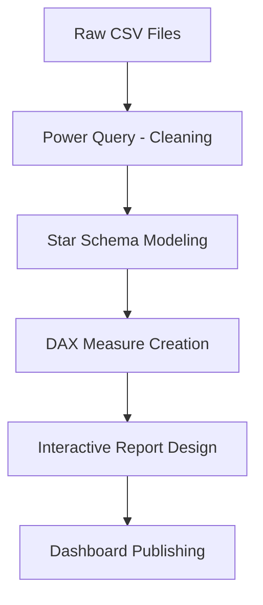

# 🏨 Revenue Insights Dashboard – Hospitality Analytics  
*A Power BI Business Intelligence Solution for Hotel Revenue Optimization*

This repository presents a complete end-to-end business intelligence project built for **Atliq Grands** (a fictional multinational hotel chain), submitted as part of the **Codebasics Power BI Resume Project Challenge #1**. The goal is to derive actionable insights to optimize hotel revenue using data analytics and dashboarding techniques.

---

## 📊 Project Overview

This project empowers hotel management to:
- Monitor **Revenue per Available Room (RevPAR)**, **ADR**, and **Occupancy %** in real-time.
- Understand room performance across different **cities and room classes**.
- Detect seasonal patterns, weekday vs weekend differences, and platform-wise realization.
- Support strategic decisions to improve pricing, capacity utilization, and customer retention.

---

## 🎯 Business Requirements & Solutions

| Business Need | Implemented Solution |
|---------------|----------------------|
| Track real-time KPIs | Dynamic cards showing Revenue, RevPAR, DSRN, etc. |
| Identify low-occupancy periods | Weekly trends & calendar slicers |
| Compare weekdays vs weekends | Tabular breakdown of day types |
| Analyze room performance | Bubble chart: ADR vs Realization by room class |
| Spot seasonal cancellations | Line graph: cancellation % over time |
| Evaluate booking platforms | Bar-line chart showing realization & ADR by platform |

---

## 🖼️ Dashboard Preview


*Figure: Sample dashboard with key hospitality metrics, filters, and trends.*

---

## 📂 Project Structure

```
Revenue_Insights_Dashboard_Hospitality_Domain-/
├── assets/
│   └── dashboard-preview.png
├── datasets/
│   ├── Bookings.csv
│   ├── Properties.csv
│   ├── Rooms.csv
│   └── Date.csv
├── Revenue_Insights_Dashboard.pbix
├── README.md
```

---

## 📁 Dataset Summary

| Table | Description |
|-------|-------------|
| `Bookings.csv` | Booking records with dates, room type, revenue, and status |
| `Properties.csv` | Property ID, location, and type |
| `Rooms.csv` | Room classes and inventory |
| `Date.csv` | Calendar data with month, day, and type (weekday/weekend) |

The data is modeled in **star schema** for performance and clarity.

---

## 🧮 Key Metrics (DAX Examples)

```DAX
-- Revenue per Available Room (RevPAR)
RevPAR = DIVIDE(SUM(bookings[revenue_realized]), SUM(aggregated_bookings[capacity]), 0)

-- Booking Realization %
Realization = DIVIDE(SUM(bookings[successful_bookings]), SUM(bookings[total_bookings]), 0)
```

Additional Metrics:
- **ADR** = Revenue / Successful Bookings
- **Occupancy %** = (Successful Bookings / Room Capacity) × 100
- **DSRN** = Total Rooms - Out-of-Service Rooms

---

## ⚙️ Technical Highlights

### ✅ Power BI Workflow



### ✅ Optimization Techniques
- Query Folding in Power Query for performance
- Use of summarized tables for better visuals
- Performance Analyzer to identify slow visuals
- Minimized DAX complexity for real-time interaction

---

## 💡 Business Impact

> 📈 The dashboard enables revenue teams to:
- Identify **low-performing days and room classes**
- Adjust pricing with **RevPAR and ADR insights**
- Increase room availability using **DSRN planning**
- Spot **platforms with poor realization %** to re-negotiate commissions

---

## 🧪 How to Use

1. Clone this repository.
2. Open `Revenue_Insights_Dashboard.pbix` in Power BI Desktop.
3. Connect to local CSVs in `/datasets` if paths break.
4. Interact with slicers and visuals to explore insights.

---

## 📝 Disclaimer

This project is based on fictional data and is intended for learning and portfolio development only.

